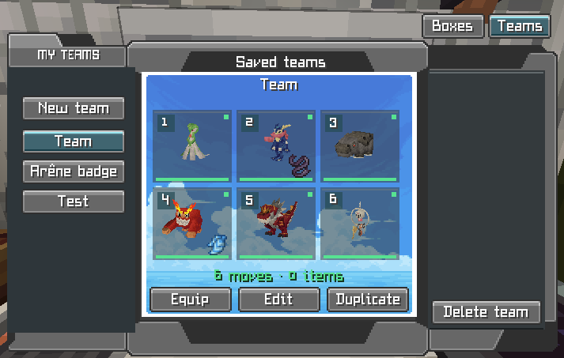
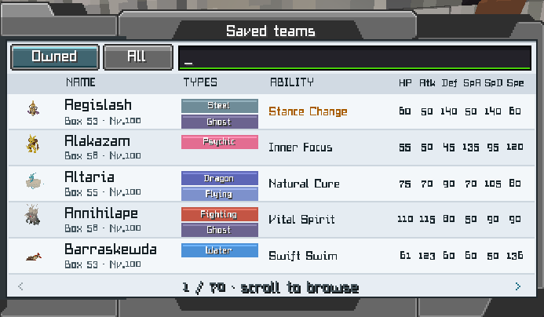
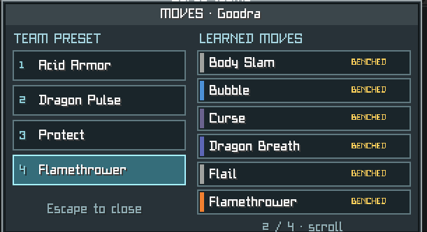
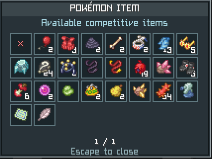

# Tropimon Team Builder

Gestionnaire d'équipes compétitives **100 % client-side** pour Minecraft 1.21.1 et Cobblemon 1.7.2.

Tropimon Team Builder ajoute un véritable onglet `Teams` à l'interface du PC Cobblemon. Il permet de créer, sauvegarder et appliquer plusieurs compositions sans base de données ni mod serveur.



## Points forts

- Autant d'équipes de 1 à 6 Pokémon que souhaité, partagées entre les serveurs pour un même joueur, avec pagination et navigation à la molette.
- Sélection parmi les Pokémon possédés ou dans le Pokédex complet de Cobblemon.
- Recherche persistante, priorité aux niveaux 100 et tri ascendant/descendant/désactivé par statistique.
- Classement du catalogue par usages de la saison Ranked sélectionnée dans la liste déroulante.
- Navigateur Pokémon élargi et adaptatif avec davantage de lignes, des colonnes plus lisibles et le détail Ranked permanent au survol.
- Assistant de composition fondé sur les coéquipiers réellement joués, avec priorité stricte aux sets Tropimon, puis Pokémon Showdown Gen 9 et enfin génération locale légale.
- Cadenas, régénération complète ou par slot, styles réellement contraignants (dont Neige et Aurora Veil séparés), mode Original méta/créatif et diagnostic `Team Doctor`.
- Éditeur de set unifié : objet, talent, nature, EV et attaques.
- Préconfiguration des objets, de l'ordre et des attaques déjà apprises par chaque Pokémon.
- Prévalidation complète avec résumé des objets absents, attaques à apprendre, talents ou formes incompatibles, doublons et EV invalides.
- Association en un clic des six modèles avec les Pokémon capturés, sans choix automatique lorsqu'il existe plusieurs exemplaires ambigus.
- File d'application visible avec progression, annulation, nouvelle tentative et reprise automatique des déplacements non confirmés ; l'interface est verrouillée pendant l'opération pour empêcher les changements accidentels.
- État visuel immédiat : Pokémon et objet prêts, objet différent ou Pokémon à remplacer.
- Application de l'équipe avec retour des Pokémon remplacés dans leur ancien emplacement du PC.
- Création, modification, duplication, suppression et annulation immédiate.
- Interface française ou anglaise selon la langue de Minecraft.
- Raccourci configurable `K` pour consulter et gérer les équipes hors du PC.

## Sélecteur de Pokémon

Le navigateur de type Pokémon Showdown propose deux modes :

- `Possédés` : uniquement les Pokémon présents dans l'équipe ou les boîtes.
- `Tous` : toutes les espèces chargées par Cobblemon. Un Pokémon non possédé sert de modèle. Après sa capture, le bouton `Associer` retrouve les exemplaires compatibles et conserve automatiquement la partie du set réellement apprise. Les attaques manquantes sont affichées en rouge dans l'interface et rappelées uniquement dans le chat local.



## Attaques et objets

Chaque preset peut mémoriser jusqu'à quatre attaques déjà apprises. Les attaques du preset sont appliquées sans modifier leurs PP actuels.



Dans l'éditeur de set, le sélecteur propose tout le catalogue compétitif afin de préparer une composition librement. La disponibilité réelle reste affichée. Pour équiper automatiquement un objet, il doit être présent dans les 36 emplacements principaux de l'inventaire ; un objet provenant d'une shulker doit donc d'abord être sorti manuellement.



## Assistant Ranked Tropimon

Dans l'éditeur, `Équipe usages` génère une composition variée à vide. Avec un ou deux Pokémon déjà placés, `Autour du noyau` construit autour d'eux à partir de leurs coéquipiers statistiques. Au-delà, `Compléter Ranked` remplit les emplacements libres ; sur une équipe complète, `Sets Ranked` actualise uniquement les presets.

Chaque nouveau membre favorise les partenaires du Pokémon ajouté juste avant, puis sa compatibilité avec toute la composition. Le générateur évite un troisième Pokémon partageant le même type tant qu'une alternative est disponible et pénalise les profils de statistiques trop répétitifs.

Les variantes sont mémorisées pendant la session et comparées aux teams sauvegardées. Une composition identique est automatiquement recalculée ; lorsque plusieurs slots sont libres, le générateur évite également de reproduire cinq membres sur six. Après une génération complète, chaque carte peut être verrouillée. Le bouton `↻ Régénérer` conserve les slots verrouillés, tandis que `↻ Ce Pokémon` recalcule seulement le membre sélectionné.

Le bouton de style fait défiler `Équilibrée`, `Offensive`, `Bulky offense`, `Stall`, `Trick Room`, `Pluie`, `Soleil`, `Sable` et `Neige`. Le `Team Doctor` vérifie ensuite les faiblesses communes, la répétition des types, la vitesse, l'équilibre des dégâts et les rôles de hazards.

Pour chaque Pokémon compatible, le mod propose le talent, l'objet, les quatre attaques, la nature et la répartition EV les plus utilisés pendant la saison choisie dans le catalogue `Tous`. L'usage, le win rate, le rang et le volume observé sont consultables directement dans le sélecteur. Ces statistiques sont conservées sur disque, affichées immédiatement au lancement, puis actualisées en arrière-plan. Comme le mod reste entièrement client-side, les natures, EV et talents conseillés sont informatifs ; aucun changement interdit n'est envoyé au serveur.

## Installation

Prérequis :

- Minecraft `1.21.1`
- Fabric Loader `0.16.0` ou plus récent
- Fabric API
- Cobblemon `1.7.2`
- Fabric Language Kotlin

Téléchargez `TropimonTeamBuilder-<version>.jar` depuis les [releases GitHub](https://github.com/FastedCorsi/TropimonTeamBuilder/releases), puis placez-le uniquement dans le dossier `mods` du client.

## Utilisation

1. Ouvrez un PC Cobblemon et cliquez sur `Teams`, ou utilisez la touche `K`.
2. Créez une équipe, donnez-lui un nom et remplissez ses six emplacements.
3. Configurez si nécessaire les objets et les attaques de chaque Pokémon.
4. Enregistrez, sélectionnez la composition, puis cliquez sur `Équiper`.

L'accès distant dépend des fonctions autorisées par le serveur. Si une composition nécessite de déplacer des Pokémon entre l'équipe et les boîtes, le serveur doit fournir un accès PC distant compatible ; sinon, ouvrez un PC placé dans le monde.

## Sauvegardes

Aucune base de données externe n'est utilisée. Les équipes sont enregistrées localement par UUID de joueur et sont donc disponibles sur tous ses serveurs :

```text
<launcher>/config/tropimon-team-saver/players/<uuid-joueur>.json
```

Les positions de retour dans les boîtes restent isolées par serveur :

```text
<launcher>/config/tropimon-team-saver/return-slots/<identifiant-serveur>/<uuid-joueur>.json
```

Le nom historique `tropimon-team-saver` est conservé pour assurer la compatibilité avec les sauvegardes des versions précédentes.

## Développement

Le wrapper Gradle utilise Java 21 :

```powershell
.\gradlew.bat clean test build
```

Le build utilise automatiquement les dépendances du launcher Tropimon lorsqu'elles sont présentes, puis les dépôts Fabric et Modrinth en solution de repli. Le JAR est généré dans `build/libs/TropimonTeamBuilder-<version>.jar`.

## Licence

Tous droits réservés. Consultez [LICENSE](LICENSE).
